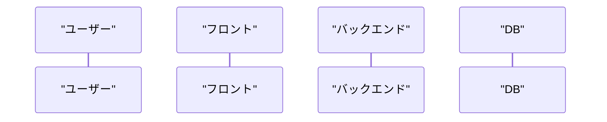

# shin-sequence-diagram

ユーザー / フロント / バックエンド / DB の処理フローを **Mermaid の `sequenceDiagram`** で可視化するユーティリティ。

## 概要

| 項目 | 内容 |
|------|------|
| 対象ツール | Claude Code / Codex |
| 用途 | 処理フローのシーケンス図作成 |
| 入力 | ユースケース説明 / API仕様 / 画面操作 / 失敗時の挙動 |
| 出力 | Mermaid `sequenceDiagram` |

## 使用例

```bash
/shin-sequence-diagram ログインの流れを図にして
/shin-sequence-diagram ユーザー情報更新（成功/失敗の分岐込み）を図にして
```

## 出力例（形式）



