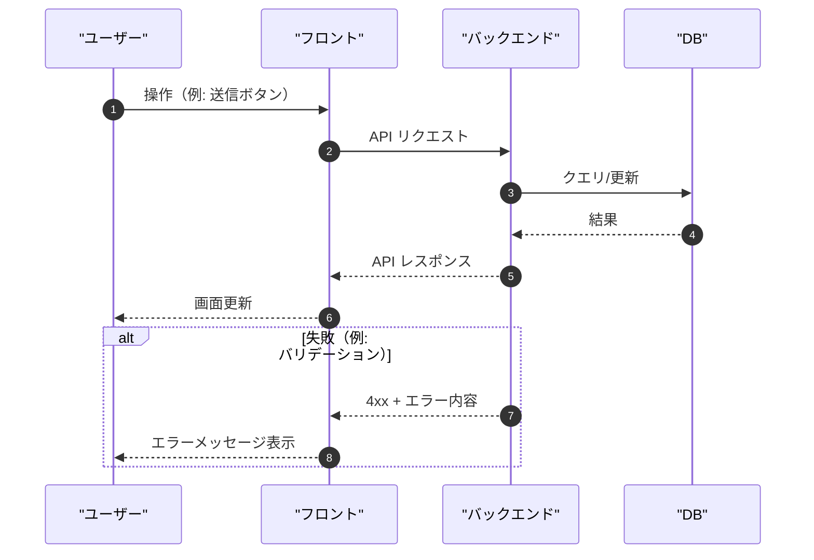

# Sequence Diagram Skill

ユーザー / フロント / バックエンド / DB の基本4者で、処理フローを **Mermaid の `sequenceDiagram`** として出力する。

## 入力

次のいずれかを渡す:
- ユースケース説明（例: ログイン、一覧取得、更新、決済）
- API 仕様（エンドポイント、入力、出力）
- 画面遷移・ユーザー操作
- 失敗時の挙動（validation、認可、DB エラー等）

不足が大きい場合は、先に **最大3問まで** 確認質問してから作図する。

## 出力ルール

- Mermaid のコードブロック（` ```mermaid `）を作成し、`./docs/{topic}/sequence-diagram.md` に保存する。
- 参加者は原則 4者固定:
  - `User`（ユーザー）
  - `Frontend`（フロント）
  - `Backend`（バックエンド）
  - `DB`（DB）
- 可能なら `autonumber` を入れる。
- メッセージは「動詞 + 対象」で短く（例: `POST /api/login`、`SELECT user`）。
- 成功/失敗の分岐は `alt` / `else` で表現する（空欄禁止）。

## テンプレート



## 追加オプション（必要なときだけ）

- 認可/認証、外部 API、キャッシュなどの登場人物が必要なら、追加して良い（ただし必ず理由を添える）。
- 「図として生成したい」と言われたら、環境に `mcp__figma__generate_diagram` がある場合は Mermaid を渡してリンクを返す。

## ファイル出力

作成したシーケンス図は次に保存する:

```
./docs/{topic}/sequence-diagram.md
```

## 次のステップ案内

```markdown
## 計画書を出力しました

📄 `./docs/{topic}/sequence-diagram.md`
```
